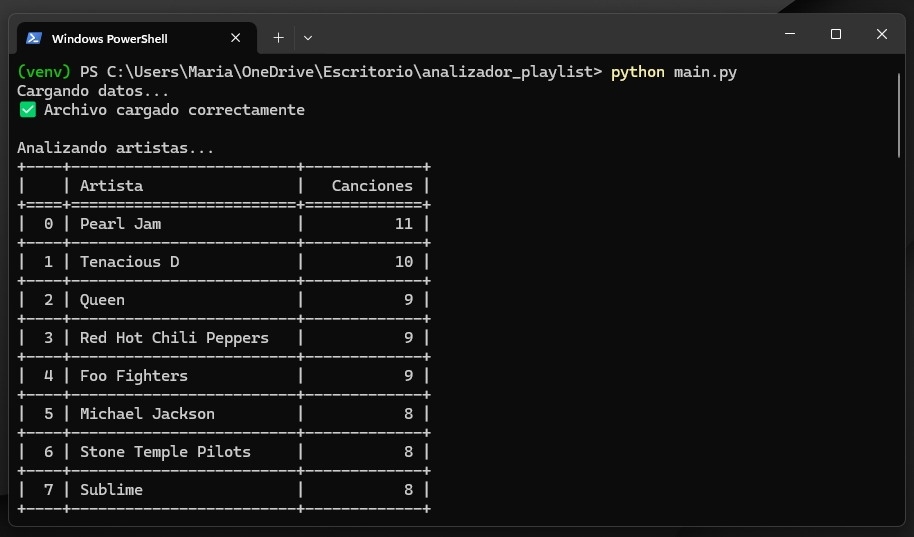
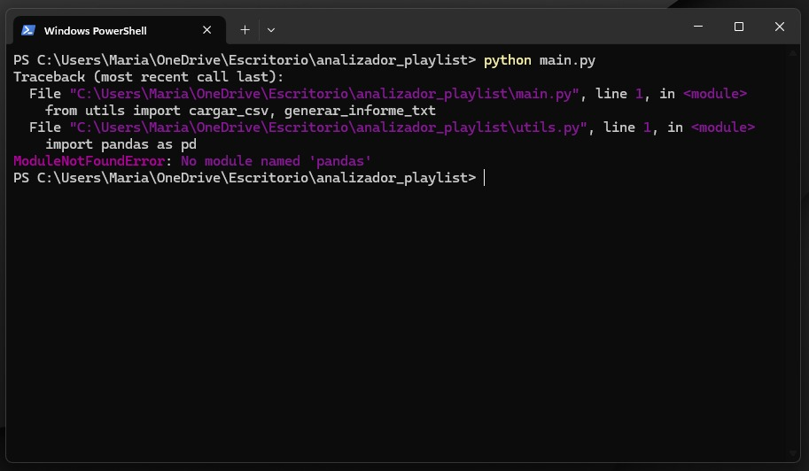

# 🎵 Analizador de Playlist de Spotify

Este proyecto analiza una playlist exportada desde Spotify en formato CSV y genera un informe completo con estadísticas como:

- Top 10 artistas más frecuentes  
- Canciones agregadas por día de la semana  
- Canciones agregadas por mes  
- Clasificación de canciones por duración  
- Canciones menos populares  
- Informe en texto y gráficos autogenerados  

---

## 📁 Estructura del proyecto

```plaintext
analizador_playlist/
├── imagenes/
│   └── captura_resultado.png
├── datos/                        # Datos de entrada
│   └── mi_playlist.csv           # Archivo CSV exportado desde Spotify
├── graficos/                     # Resultados visuales (autogenerado)
│   ├── artistas_frecuentes.png
│   ├── canciones_por_dia.png
│   ├── canciones_por_mes.png
│   ├── popularidad_playlist.png
│   └── clasificacion_duracion.png
├── informes/                     # Reportes textuales
│   └── informe.txt
├── main.py                       # Punto de entrada
├── analisis.py                   # Lógica de análisis
├── utils.py                      # Funciones auxiliares
├── requirements.txt              # Dependencias
├── .gitignore                    # Archivos a ignorar por Git
└── README.md                     # Documentación del proyecto
```

---

## 🚀 Cómo usar

### 1. Preparación del entorno virtual:

```bash
python -m venv venv
# Activación en Linux/macOS:
source venv/bin/activate
# Activación en Windows:
.\venv\Scripts\activate
```
## Por qué se utiliza entorno virtual? (venv)
A. **Evitar Conflictos entre Proyectos**
   - Si tienes múltiples proyectos en tu computadora, cada uno podría necesitar **versiones diferentes** de las mismas librerías (ej: `pandas 1.3` vs `pandas 2.0`).
   - Sin `venv`, instalarás todo globalmente y podrías romper proyectos antiguos al actualizar paquetes.

B. **Facilitar la Reproducción del Proyecto**
   - Si alguien más quiere ejecutar tu código, necesitará **las mismas versiones de las librerías** que usaste. Con `venv`, puedes generar un archivo `requirements.txt` que liste todas las dependencias exactas.

C. **Limpieza y Organización**
   - Al desinstalar un proyecto, basta con eliminar su entorno virtual en lugar de buscar qué librerías globales ya no sirven.

D. **Seguridad**
   - Evitas instalar paquetes con permisos de administrador (usando `sudo pip install`), lo que podría afectar al sistema.


### 2. Instalar dependencias:

```bash
pip install -r requirements.txt
```

### 3. Preparar los datos:

Exportá tu playlist desde Spotify con [Exportify](https://exportify.net/) y colocá el archivo `.csv` dentro de la carpeta `datos/` con el nombre `mi_playlist.csv`.

### 4. Ejecutar el análisis:

```bash
python main.py
```

### 5. Ver resultados:

- Informe generado: `informes/informe.txt`  
- Gráficos generados: carpeta `graficos/`

---

## 📝 Requisitos del sistema

- Python 3.10 o superior  
- pip  
- Funciona en Windows, Linux y macOS

---

## 📦 Dependencias (requirements.txt)

```txt
contourpy==1.3.2
cycler==0.12.1
fonttools==4.58.5
kiwisolver==1.4.8
matplotlib==3.10.3
numpy==2.3.1
packaging==25.0
pandas==2.3.1
pillow==11.3.0
pyparsing==3.2.3
python-dateutil==2.9.0.post0
pytz==2025.2
six==1.17.0
tabulate==0.9.0
tzdata==2025.2
```
---

### 📄 Contenido del README.md

- Descripción del proyecto  
- Requisitos e instalación  
- Instrucciones de uso paso a paso  
- Dependencias necesarias  
- Estructura de carpetas y archivos  
- Ejemplos de salida

---

## ▶️ Ejemplo de salida

### En la consola veran lo siguiente en este orden
```bash
✅ Archivo cargado correctamente.
🎶 Top 10 artistas más frecuentes...
📆 Canciones agregadas por día/mes...
📉 Canciones menos populares detectadas.
⏱️ Clasificación de duración completada.
📄 Informe generado en: informes/informe.txt
```
### Ejemeplos de salida utilizando (venv)
A continuación se podra observar que la aplicación funciona solamente teniendo activo el entorno virtual:



Ejemplo de si el venv no esta activado


**🔴 IMPORTANTE:**  
Según la playlist que utilicen puede que los valores del apartado "menos populares" les dé 0.  
Esto se debe a que Spotify no califica como música mainstream las canciones de la playlist,  
por ende son "menos populares" aún.

---

A continuación, les dejo el ejemplo de lo mencionado y después otro análisis con canciones más populares:

---

## 🙋 Autor

**Mariano Juan Lorea**  
Trabajo Final – Programación I (I.S.T.E.A.)  
Año: 2025
